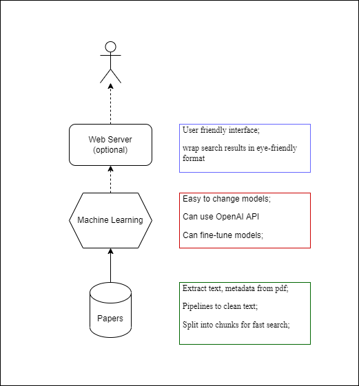

# Academic Paper Semantic Search

--------


Academic Paper Semantic Search is a localized search engine, providing plain text search on a collection of pdf papers.
Search methods include neural network based search (BERT based) and simple dictionary based matching (`BM25`).

It requires Human Intelligence on top of Artificial Intelligence, so it will not be a local ``ChatGPT``. 

The current version is designed to run in laptops without GPU, so large neural network models are not used. But this program modularizes the search algorithm, so  you can easily swap the state of art models. Lite versions are strongly recommended.

If you are interested in fine-tuning large models with limited GPU, I strongly recommend one of the BOOM paper below (or the first figure). Training a model with 100+ Billion parameters requires a different skill set.  It's easy to torture one Nvidia 2080 Ti for a year, but it is not enough.

  * [The BigScience Architecture & Scaling Group(2022) *What Language Model to Train if You Have One Million GPU Hours?*](https://arxiv.org/abs/2210.15424)


# Architecture 



## How To Start Web Server
1. Create virtual environment. Recommend using ``mamba`` rather than `conda` to install packages
  ```cmd
  conda create -p env/  python=3.9 
  conda activate env/
  pip install --upgrade pip
  pip install farm-haystack[sql,only-faiss,inmemorygraph]  streamlit st-annotated-text
  ```

2. You may want the GPU version if possible
  ```cmd
  conda activate env/
  pip install farm-haystack[only-faiss-gpu] transformers[torch]
  ```
  Windows users may have trouble installing the `faiss-gpu` in the `farm-haystack`. An alternative is 
  ```cmd 
  conda activate env/
  conda install -c conda-forge faiss-gpu
  ```

1. Copy `data/db-*` folders to `data/` and run
  ```cmd  
  ../env/python -m streamlit run ui/Search.py --server.runOnSave=true --server.address=127.0.0.1
  ``` 
 
  This script starts FastAPI for query
  ```cmd 
  %~dp0./env/python.exe -m uvicorn rest_api.search_rest_gunicorn:app --host 127.0.0.1 --port 7999 --workers 1 
  ```
  This script starts the webserver
  ```cmd
    %~dp0./env/python -m streamlit run ui/Search.py --server.runOnSave=true --server.address=127.0.0.1
  ```
**Note**: without the ``--server.address=127.0.0.1``, `streamlit`will broadcast your ip address to the world.

## How to Build From Scratch

### Prepare PDF

* Install Zotera, and plug-in ``ZotFile`` and ``DOI Manager``
    * `Tool -> ZotFile Preference-> use subfolder defined by`: `[%a](%y){ %t}`
    * `ZotFile Preference-> Renaming Rules -> Format for all item & Patents`: `[%a](%y){ %t}`
    * `ZotFile Preference-> Tablet Settings`: check `use ZotFile to send and get files from tablet`, and
      set `base folder`
* Import pdf papers into Zotero, obtain `doi` and clean up metadata
* Select all pdf and right click, management attachments, sent to tablet
* Use `Adobe Pro` or `Abbyy` for batch text recognition

### Extract Plain Text (Better Way)

* Use Adobe Pro to recognize and export pdf to word document
* use Pandoc to convert to plain text:

   ``pandoc -f docx -i file_name.docx -t plain -o file_name.txt``

### Extract Plain Text (Old Way)


Use virtual environment to manage python packages. Many of them may have conflict with your current packages.

* Download [GROBID](https://github.com/kermitt2/grobid) docker image and the
  python [client](https://github.com/kermitt2/grobid_client_python).
  The [CRT-only](https://grobid.readthedocs.io/en/latest/Grobid-docker/#crf-only-image) is enough.
* Run `src/extract_text.py` to convert pdf to `tei.xml` format and parse them into plain text
* May need spell check

### Build Database
* Recommend  ``mamba`` to install packages
* Install [haystack](https://github.com/deepset-ai/haystack) python package or docker image
    * need to install faiss; given the small number of documents, the cpu version is fast enough
    * if possible, recommend `` mamba install -c conda-forge libfaiss-avx2 ``
    * if want to embed documents, need `transformer[torch]` package
*  `git clone https://github.com/kermitt2/grobid_client_python`
* run `src/build_database.py`
* Simple dictionary search use [BM25](https://docs.haystack.deepset.ai/docs/retriever#bm25-recommended) and In Memory
  database.
    * Documents are chunked into sentences. Each has at most 300 words with 10 words overlap.
    * May need to tune sentence length for better performance
* Neural Network based search use [sentence-transformer](https://www.sbert.net/) to embed words. Data are stored
  in [FAISS](https://github.com/facebookresearch/faiss)
    * Documents are chunked into sentences with at most 100 words
    * Embedding model use (need GPU for fast process)
        * `sentence-transformers/multi-qa-mpnet-base-dot-v1`
        * `sentence-transformers/msmarco-distilbert-base-tas-b`
* databases are in the ``data`` folder. Copy `db-faiss` and `db-inmemory` to `deploy/data/`

### Build Web Server

* Copy the [haystack-demos](https://github.com/deepset-ai/haystack-demos) and modify scripts in the ``ui`` folder. The
  main part is `webapp.py`
* The sample scripts use ``haystack`` api and docker, but you can run your script directly without docker.

### Build FAISS From Source

Windows users who have Intel cpu and want faster matching speed may want to compile the `avx2` version from source. You can 
link the MKL library for faster speed.

* Install  `visual studio 2019`  (desktop development with C++), `cuda toolkit`, `Intel OneAPI toolkit`,
  and `swig`
* Use conda env to activate desired python version
* Download the latest `faiss` release. 
* Assume install with default settings, in ``cmd``, activate environment variables

  ```cmd
  conda activate "path to desire python env"
  "C:\Program Files (x86)\Intel\oneAPI\setvars.bat"
  ```
  MKL library will be loaded automatically. If you don't need GPU, set `-DFAISS_ENABLE_GPU=OFF`

  ```cmd
  "C:\Program Files (x86)\Microsoft Visual Studio\2019\Enterprise\Common7\IDE\CommonExtensions\Microsoft\CMake\CMake\bin\cmake.exe" -B build ^ 
    -DFAISS_ENABLE_PYTHON=ON ^
    -DFAISS_ENABLE_GPU=ON ^
    -DBUILD_SHARED_LIBS=ON ^ 
    -DCMAKE_BUILD_TYPE=Release ^
    -DFAISS_OPT_LEVEL=avx2 ^
    -DBUILD_TESTING=OFF 
  ```
  `maxCpuCount` default is 1, include the switch without number will use all cores
  ```cmd
  MSBuild.exe build/faiss/faiss_avx2.vcxproj /property:Configuration=Release /maxCpuCount:12
  ```
  Or you may use Visual Studio to open `faiss/build/ALL_BUILD.vcxproj`, select `release`, and build `swigfaiss_avx2`

* Build python wheel
  ```cmd
  cd build/faiss/python/
  python setup.py bdist_wheel
  python setup.py install
  ```

## TODO

* Spell check for plain text
* Fine tune embedding models
* Check quality & runtime for joint model: combine multiple embedding models for neural network based search 